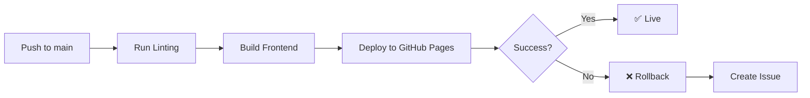

# Template WebApp - React + TypeScript + Vite + Node.js + SQLite

[](https://github.com/YOUR_USERNAME/template-webapp-react-ts-vite/actions/workflows/ci.yml)
[](https://github.com/YOUR_USERNAME/template-webapp-react-ts-vite/actions/workflows/deploy.yml)
[](https://opensource.org/licenses/MIT)

A professional, production-ready full-stack web application template designed to be forked and customized for your next project. Built with modern technologies and best practices.

## 🚀 Tech Stack

### Frontend
- **React 18** - A JavaScript library for building user interfaces
- **TypeScript** - Type-safe JavaScript
- **Vite** - Next generation frontend tooling
- **ESLint** - Code linting
- **Prettier** - Code formatting

### Backend
- **Node.js** - JavaScript runtime
- **Express** - Web application framework
- **TypeScript** - Type-safe JavaScript
- **TypeORM** - Object-relational mapping
- **SQLite3** - Embedded database

### DevOps & Tools
- **GitHub Actions** - CI/CD pipelines
- **Husky** - Git hooks
- **lint-staged** - Pre-commit linting
- **Yarn Workspaces** - Monorepo package management

## 📋 Features

- ✅ **Full-Stack TypeScript** - Type safety across the entire stack
- ✅ **Hot Module Replacement** - Fast development with instant updates
- ✅ **Database Integration** - Ready-to-use SQLite database with TypeORM
- ✅ **API Ready** - RESTful API with example CRUD endpoints
- ✅ **Code Quality** - ESLint, Prettier, and pre-commit hooks
- ✅ **CI/CD Pipeline** - Automated testing and deployment
- ✅ **GitHub Pages Deployment** - Automatic frontend deployment
- ✅ **Auto-Rollback** - Automatic rollback on deployment failures
- ✅ **Monorepo Structure** - Clean separation of concerns

## 🏗️ Project Structure

```
template-webapp-react-ts-vite/
├── frontend/                  # React + Vite frontend
│   ├── src/
│   │   ├── components/       # React components
│   │   ├── services/         # API service layer
│   │   ├── App.tsx          # Main app component
│   │   └── main.tsx         # Entry point
│   ├── public/              # Static assets
│   ├── index.html           # HTML template
│   ├── vite.config.ts       # Vite configuration
│   └── package.json         # Frontend dependencies
│
├── backend/                  # Node.js + Express backend
│   ├── src/
│   │   ├── config/          # Configuration files
│   │   ├── controllers/     # Request handlers
│   │   ├── entities/        # TypeORM entities
│   │   ├── routes/          # API routes
│   │   └── index.ts         # Entry point
│   └── package.json         # Backend dependencies
│
├── .github/
│   └── workflows/           # GitHub Actions workflows
│       ├── ci.yml          # PR checks
│       └── deploy.yml      # Deployment pipeline
│
├── .husky/                  # Git hooks
├── package.json            # Root package.json
└── README.md              # This file
```

## 🚀 Getting Started

### Prerequisites

- **Node.js** (v18 or higher)
- **Yarn** (v4.x)
- **Git**

### Installation

1. **Fork this repository** to your GitHub account

2. **Clone your forked repository**
   ```bash
   git clone https://github.com/YOUR_USERNAME/template-webapp-react-ts-vite.git
   cd template-webapp-react-ts-vite
   ```

3. **Install dependencies**
   ```bash
   yarn install
   ```

4. **Setup environment variables**
   ```bash
   cp backend/.env.example backend/.env
   ```

5. **Start development servers**
   ```bash
   # Start both frontend and backend
   yarn dev
   
   # Or start them separately:
   yarn dev:frontend  # Frontend on http://localhost:3000
   yarn dev:backend   # Backend on http://localhost:5000
   ```

### First Time Setup

After installation, the pre-commit hooks need to be initialized:

```bash
yarn prepare
```

This will set up Husky to automatically format your code before each commit.

## 🛠️ Development

### Available Scripts

#### Root Level
- `yarn dev` - Start both frontend and backend in development mode
- `yarn build` - Build both frontend and backend for production
- `yarn lint` - Run linting on both frontend and backend
- `yarn format` - Format all code with Prettier
- `yarn format:check` - Check code formatting

#### Frontend
- `yarn dev:frontend` - Start frontend development server
- `yarn build:frontend` - Build frontend for production
- `yarn lint:frontend` - Lint frontend code

#### Backend
- `yarn dev:backend` - Start backend development server
- `yarn build:backend` - Build backend for production
- `yarn lint:backend` - Lint backend code

### Database

The application uses SQLite with TypeORM. The database file (`database.sqlite`) is created automatically when you start the backend.

#### Adding New Entities

1. Create a new entity in `backend/src/entities/`
2. Add it to the `entities` array in `backend/src/config/database.ts`
3. TypeORM will auto-create tables in development mode

#### Example: Creating a User Entity

```typescript
// backend/src/entities/User.ts
import { Entity, PrimaryGeneratedColumn, Column } from 'typeorm';

@Entity()
export class User {
  @PrimaryGeneratedColumn()
  id!: number;

  @Column()
  email!: string;

  @Column()
  name!: string;
}
```

### API Development

All API routes are prefixed with `/api`. The frontend is configured to proxy API requests to the backend during development.

**Example API Endpoints:**
- `GET /api/items` - Get all items
- `GET /api/items/:id` - Get item by ID
- `POST /api/items` - Create new item
- `PUT /api/items/:id` - Update item
- `DELETE /api/items/:id` - Delete item

## 🚢 Deployment

### GitHub Pages Setup

1. **Enable GitHub Pages**
   - Go to your repository Settings
   - Navigate to Pages
   - Source: GitHub Actions

2. **Configure Base Path** (if using a project page)
   
   Update `frontend/vite.config.ts`:
   ```typescript
   export default defineConfig({
     base: '/your-repo-name/',
     // ... other config
   });
   ```

3. **Push to main branch**
   ```bash
   git push origin main
   ```

The deployment workflow will automatically:
- ✅ Run linting and type checks
- ✅ Build the application
- ✅ Deploy to GitHub Pages
- ✅ Create an issue if deployment fails
- ✅ Provide rollback information

### Deployment Workflow



### Environment Variables

For production deployment, you may need to set environment variables:

**Frontend** - Add to GitHub Actions workflow:
```yaml
env:
  VITE_API_URL: https://your-backend-url.com
```

**Backend** - Configure in your hosting platform:
```
NODE_ENV=production
PORT=5000
DB_PATH=./database.sqlite
```

## 🔧 Customization

### Changing the App Name

1. Update `package.json` files (root, frontend, backend)
2. Update `frontend/index.html` title
3. Update this README
4. Update GitHub repository name and description

### Adding Dependencies

```bash
# Add to frontend
yarn workspace frontend add package-name

# Add to backend
yarn workspace backend add package-name

# Add to root (dev dependencies)
yarn add -D -W package-name
```

### Styling

This template uses vanilla CSS. You can easily integrate:
- **Tailwind CSS**
- **Material-UI**
- **Styled Components**
- **CSS Modules** (already supported by Vite)

### Backend Framework

While Express is used by default, you can swap it for:
- **Fastify** - For higher performance
- **NestJS** - For enterprise applications
- **Koa** - For a more modern approach

## 🧪 Testing

This template is ready for testing. You can add:

**Frontend Testing:**
- **Vitest** - Unit testing
- **React Testing Library** - Component testing
- **Cypress** - E2E testing

**Backend Testing:**
- **Jest** - Unit testing
- **Supertest** - API testing

## 📝 Code Quality

### Pre-commit Hooks

The repository uses Husky and lint-staged to automatically:
- ✅ Lint code with ESLint
- ✅ Format code with Prettier
- ✅ Run before each commit

### CI/CD Checks

Pull requests automatically run:
- ✅ Code formatting checks
- ✅ Linting (frontend and backend)
- ✅ TypeScript compilation
- ✅ Build verification

## 🤝 Contributing

1. Fork the repository
2. Create a feature branch (`git checkout -b feature/amazing-feature`)
3. Commit your changes (`git commit -m 'Add amazing feature'`)
4. Push to the branch (`git push origin feature/amazing-feature`)
5. Open a Pull Request

### Commit Convention

This project follows conventional commits:
- `feat:` - New feature
- `fix:` - Bug fix
- `docs:` - Documentation changes
- `style:` - Code style changes (formatting, etc.)
- `refactor:` - Code refactoring
- `test:` - Adding or updating tests
- `chore:` - Maintenance tasks

## 📄 License

This project is licensed under the MIT License - see the [LICENSE](LICENSE) file for details.

## 🆘 Support

- 📖 [Documentation](https://github.com/YOUR_USERNAME/template-webapp-react-ts-vite/wiki)
- 🐛 [Issue Tracker](https://github.com/YOUR_USERNAME/template-webapp-react-ts-vite/issues)
- 💬 [Discussions](https://github.com/YOUR_USERNAME/template-webapp-react-ts-vite/discussions)

## 🎯 Roadmap

- [ ] Add authentication (JWT)
- [ ] Add user management
- [ ] Add Docker support
- [ ] Add comprehensive testing setup
- [ ] Add API documentation (Swagger)
- [ ] Add database migrations
- [ ] Add logging system
- [ ] Add monitoring and analytics

## 🙏 Acknowledgments

- [Vite](https://vitejs.dev/) - For the amazing build tool
- [React](https://react.dev/) - For the UI library
- [TypeORM](https://typeorm.io/) - For the excellent ORM
- [Express](https://expressjs.com/) - For the web framework

---

**Made with ❤️ for the developer community**

⭐ Star this repository if you find it helpful!
